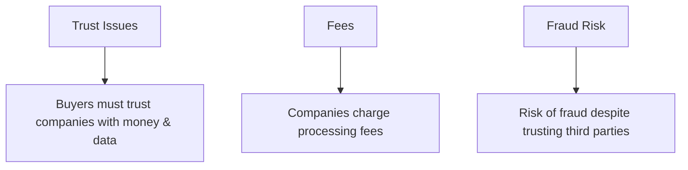
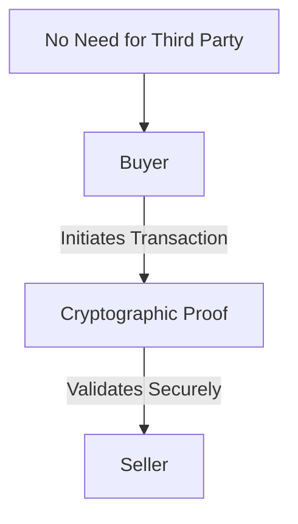
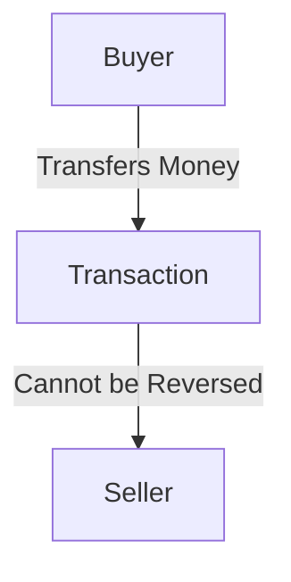
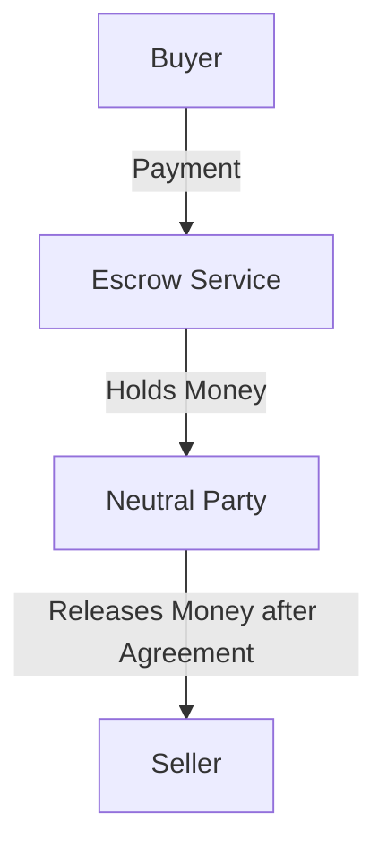
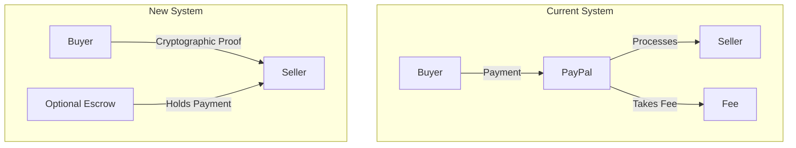
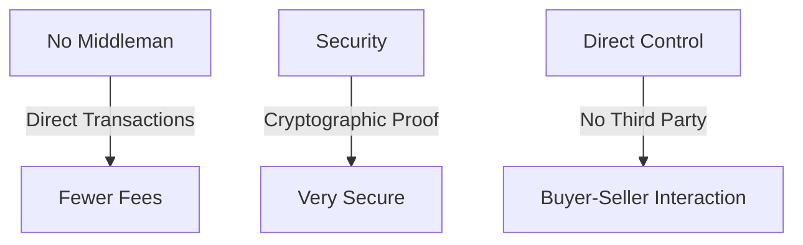

### Current System: Trusted Third Parties

```mermaid
flowchart TD
    A[Buyer] -->|Initiates Payment| B[Trusted Third Party (e.g., PayPal)]
    B -->|Processes Payment| C[Seller]
    B -->|Takes Fee| D[Fee Charged]
    B -->|Handles Disputes| E[Buyer/Seller Trust]
```

### Problems with Trust-Based Model



### New System Idea: Cryptographic Proof and Direct Transactions



### Irreversible Transactions



### Buyer Protection with Escrow



### Example: Current System vs. New System



### Benefits of the New System

