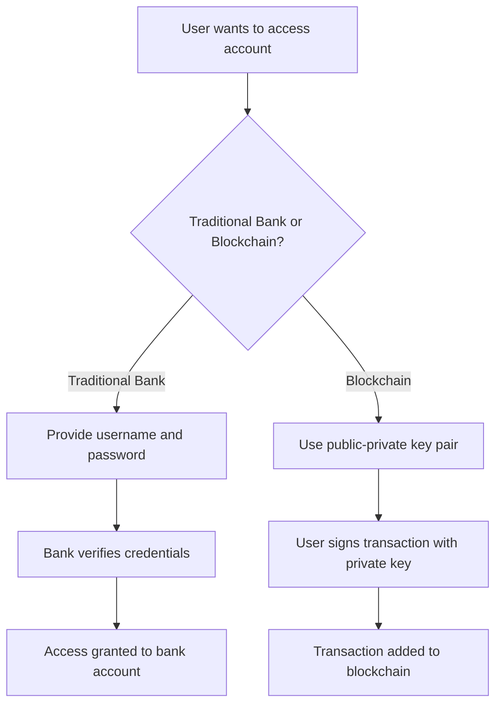
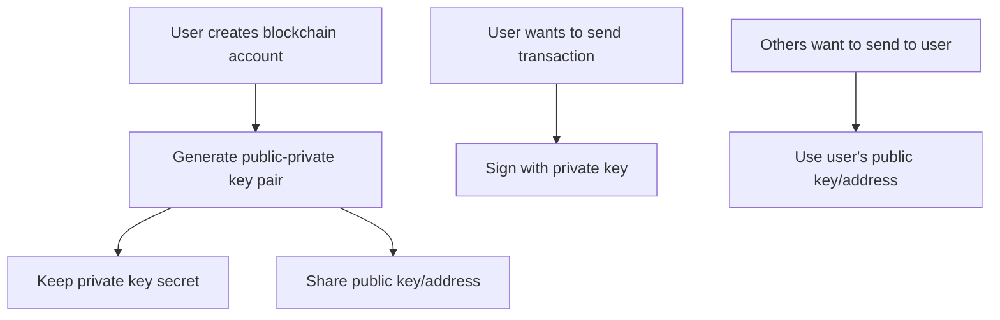
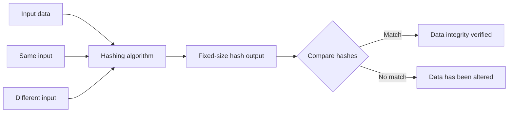
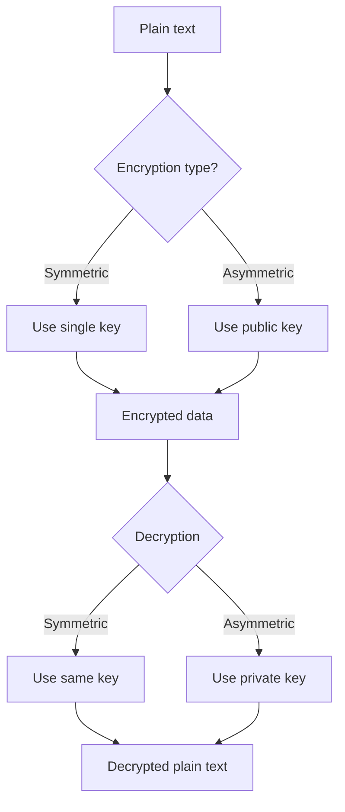

# Bank Authentication vs Blockchain Authentication

```mermaid
flowchart TD
    A[User wants to access account] --> B{Traditional Bank or Blockchain?}
    B -->|Traditional Bank| C[Provide username and password]
    B -->|Blockchain| D[Use public-private key pair]
    C --> E[Bank verifies credentials]
    D --> F[User signs transaction with private key]
    E --> G[Access granted to bank account]
    F --> H[Transaction added to blockchain]
```

# Public-Private Key Pair Usage

```mermaid
flowchart TD
    A[User creates blockchain account] --> B[Generate public-private key pair]
    B --> C[Keep private key secret]
    B --> D[Share public key/address]
    E[User wants to send transaction] --> F[Sign with private key]
    G[Others want to send to user] --> H[Use user's public key/address]
```

# Hashing Process

```mermaid
flowchart LR
    A[Input data] --> B[Hashing algorithm]
    B --> C[Fixed-size hash output]
    D[Same input] --> B
    E[Different input] --> B
    C --> F{Compare hashes}
    F -->|Match| G[Data integrity verified]
    F -->|No match| H[Data has been altered]
```

# Encryption Process

```mermaid
flowchart TD
    A[Plain text] --> B{Encryption type?}
    B -->|Symmetric| C[Use single key]
    B -->|Asymmetric| D[Use public key]
    C --> E[Encrypted data]
    D --> E
    E --> F{Decryption}
    F -->|Symmetric| G[Use same key]
    F -->|Asymmetric| H[Use private key]
    G --> I[Decrypted plain text]
    H --> I
```